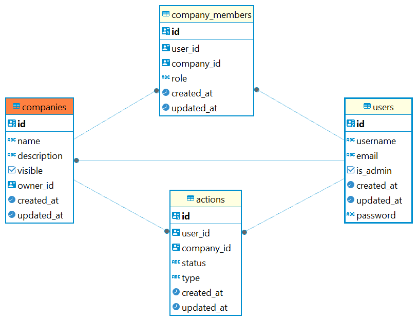

# FastAPI Application internship_meduzzen_backend

## Getting Started

To get started with this project, you will need to have Python and pip installed on your machine.
### Prerequisites

- Python (version 3.6 or higher)
- pip (version 3.7 or higher)

### Installation

1. **Clone the repository:**

    ```bash
    git clone https://github.com/VadimTrubay/internship_meduzzen_backend.git
    cd internship_meduzzen_backend
    ```
2. **Create and activate a virtual environment:**

    Create a `.env` file based on `.env.sample`:
    ```bash
    python -m venv venv
   
   .\venv\Scripts\activate
    ```
   
3. **Install dependencies:**

    Using pip:
    ```bash
    pip install -r requirements.txt
    ```
   
4. **Create environment variables:**

    Create a `.env` file based on `.env.sample`:
    ```bash
    cp .env.sample .env
    ```

### Running the Development Server

To start the development server, run:

```bash
python -m app.main
```

After the server starts, open your web browser and navigate to:
http://127.0.0.1:8000/

### Using Docker
Build the Docker Compose, run:

```bash
docker-compose up --build
```

### Getting Started with Alembic
Apply Migrations, run:
```bash
alembic upgrade head
```
[//]: # (1. Install Alembic, run:)

[//]: # (```bash)

[//]: # (pip install sqlalchemy alembic)

[//]: # (```)

[//]: # (2. Initialize Alembic, run:)

[//]: # (```bash)

[//]: # (alembic init alembic)

[//]: # (```)

[//]: # (3. Generate Migrations, run:)

[//]: # (```bash)

[//]: # (alembic revision --autogenerate -m "initial migration")

[//]: # (```)


### Stopped the application
To stop the development server, run:

```bash
Ctrl + C
```

### Running the Tests
To running the tests, run:

```bash
pytest
```

```bash
ERD
https://github.com/VadimTrubay/internship_meduzzen_backend/blob/BE_9_add_company_actions/ERD_public_companies.png?raw=true


